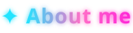
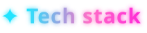
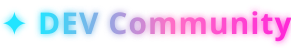
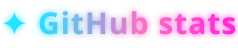

 

<h3></h3>

<!-- Stacked rather than a two-column table so the list gets the full width on mobile. -->

  

✦ **Full-stack** with Ruby on Rails — check out my app [goVend](https://www.govend.ing/) 
✦ **Self-hosting** my own [microserver](https://www.annavillarreal.com/) 
✦ **E-commerce** with Stripe at [Ever Fluorescent](https://everfluorescent.com/) 
✦ **AI tinkering** with Ollama, Claude & Copilot — built **Catbot**, a custom AI desktop pet 🐈‍⬛ 
✦ **Google integrations** like Maps and Gemini 
✦ **Weather app** powered by NOAA's free API 
✦ **Tech support & documentation** experience 
✦ **Learning** Node, Python & Java 
✦ I share my experiences on [DEV.to](https://dev.to/annavi11arrea1) ✍️

<h3></h3>

<h3></h3>

<!-- Follower badge refreshes daily (update-followers.yml); badge collection refreshes monthly (update-devto-badges.yml). -->

  

<h3></h3>

<h3></h3>

<h4></h4>

  

